# Intro to Web Development

## Header 2

### Header 3

#### Header 4

##### Header 5

###### Header 6

---

*ITALICS*

__BOLD__

1. Organized list
2. Ain't it sweet
    1. Hello

* Unorganized List
* Ain't it pretty
    - World

 `This is a code snippet`

```
This
is
a
code
block
```

## Development Websites

* mozilla.org
* javascript.info
# Source Code and GitHub

## Git Help for MTEC

1. git status
2. git add < . --all [filename] >
3. git commit -m ""
4. git status to verify
5. git push 

### Branches

1. git branch >> will find out what branch you are in and what branches that have already been created
2. git branch [branchName]
    - git checkout -b [branchName]
3. 

### Merge and Diff

1. git checkout -b [branchName]
2. make changes to files
3. git add and commit
4. git push
5. git merge main
6. git diff main [branchName]

### Merge Errors

* When working with branches make sure to pull before you push your code it helps avoiding merge problemscd 

## Bash Shell

* Bash is a command line shell
    - gives you UNIX commands
    - effciently to run complex tasks
* Dominant shell on UNIX
* The UNIX philosoply
    - Write programs that do one thing and do it well
    - Write programs to work well
    - Write programs to handle text streams
        * because that is a universal interface
* Copying Command
    - `cp -R source_dir target_dir`
    - you can have multiple directories for the source directory even a files will work
* Remove Command
    - rm will permantently remove files
    - rmdir will remove empty directories
    - rm -r will remove directories and everything in it 
        * be careful with this command there is no going back
* Inspect Command
    - -i
        * `rm -ri` will ask you if want to remove directory and files one by one
* You can checkout on commits
    -     do git log to find the unique commit source name to checkout to
# Html and CSS

## Inspecting Code

* be care of overlapping tags in html

## Lists, Tables, Frames and Forms

* Lists
    - `<ul>` -- will use `<li>` to create a nesting list
    - Shortcut
        * `ul>li*3{Itmes$}`
            * `>` means child of the ancestor
            * `{}` means what do you want in the elment
            * `$` numbers the children in order e.x. Items1, Items2, Items3,
* Tables
    - `<thead>` is the header of the tale
        * `<th>` will go in the header of the table
    - `<tbody>`
        * `<td>` will go in the body of the table -- td means table data
    - `<tr>` is row for the table
    - `<td colspan='3'>` -- colapses 3 colums
    - `<td rowspan='2'>` -- colapses 2 rows
    - colgroup example
    

```
    <colgroup>
        <col>
        <col>
        <col>
    </colgroup>
```

* Frames
    - `<iframe>`
* Forms
    - `<input>` and `<label>` are your friends
        * `<input>` has a lot of attributes
            * __*type attribute is really important and has a lot of uses better look up these*__
    - forms work heavily with javascript

## CSS Modules

* Selectors
    - Attributes
        * input[id]
        * [attribute = "value"] // exact string value is "value"
        * [attribute ~= "value"] // space limited
        * [attribute *= "value"] // not space limited
        * Immediate child selector
            * `>`
                * div > p {
                }

        * Descendant selector
            * ` ` space selector
                * div p {
                }

        * Immediate Sibling selector
            * `+`
                * p + span {
                }

        * Non-Imediate Sibling selector 
            * `~`
                * p ~ span {
                }

        * Pseudo Classes
            * :first-child
            * :last-child
            * :only-child
            * nth-child
            * first-of-type
            * last-of-type
* Box Models
    - Flexbox
        * Display: flex -- works only on direct children
    

    Flexbox Guide -- https://css-tricks.com/snippets/css/a-guide-to-flexbox/
    Flexbox Game -- flexbox froggy

* Backgrounds and Borders
    - Background
        

```
        body {
            background-image: url();
            background-size: cover;
            background-repeat: no-repeat;
        }
        ```

    - Positions
        * Static - default position (render in order)
        * Relative
            * You need give position relative and an offset
                * Offset: top, left, bottom, right
            * if you don't do both it will act like a static position
        * Absolute
            * position is very similar to fixed but it's fixed to it's parent/ancestor
        * Fixed
            * Postion is relative to the user's view point
                

```
                bottom: 0px;
                left: 0px;
                ```

            * Fixed position will be at the bottom left
        * Sticky
            * use offsets for positioning but when it leaves offset position it will stick to the top of the screen
                * Ex. Menu bars will sometimes follow the user when they are scrolling the web page
        * Offsets
            * Top
            * Bottom
            * Left
            * Right
            * Width
            * Height
            * Z-Index
                * -1 puts it behind the header or image
                * needs a position 
* Text Effects
    - Colors 
        * rgba (255,255,255,0.5)
            * the .5 is transparentcy this is not like the CSS opacity rule the opacity rule affects the parent and child element but the rgba will only affect the element you are on.
    - Background
        * background-color
        * background-image
        * background-repeat
        * background-attachment
        * background-position
    - Text
        * px - pixels
        * em - industry font size
        * text-align
        * text-decoration: none
        * color
        * font-weight: bold
* Transformations
    - SVG
        * vector graphic designs
* Transitions and Animations
    - Animations
        * @keyframes
        

```
        @keyframes colorChange {
            from {background-color: grey;}
            to {background-color: red}
        }

        div {
            width: 100px;
            height: 100px;
            background-color: grey;
            animation-name: colorChange;
            duration: 5s
        }
        ```

    - Transitions
    - Media

### Cascade Algotithm

1. user agent normal
2. user agent !important
3. user normal
4. author normal
5. css animation
6. author !important
7. user !important

!important overwrite

* Selector Specificity
    1. Inline Style
    2. ID's
    3. Classes
    4. Elements and Pseudo-Elements

# SCSS/SASS

## LESS and SASS

* LESS and SASS provide syntax that organizes CSS in programmatic fashion

# BootStrap
* BootStrap is mobile first -- makes it easier to position
* This is a good website -- https://getbootstrap.com/docs/5.3/layout/grid/
    * Look at the side nav and go through them when needed

* BootStrap starting code
```
<script defer src="https://cdn.jsdelivr.net/npm/bootstrap@5.3.0-alpha1/dist/js/bootstrap.bundle.min.js"
        integrity="sha384-w76AqPfDkMBDXo30jS1Sgez6pr3x5MlQ1ZAGC+nuZB+EYdgRZgiwxhTBTkF7CXvN"
        crossorigin="anonymous"></script>
    <link href="https://cdn.jsdelivr.net/npm/bootstrap@5.3.0-alpha1/dist/css/bootstrap.min.css" rel="stylesheet"
        integrity="sha384-GLhlTQ8iRABdZLl6O3oVMWSktQOp6b7In1Zl3/Jr59b6EGGoI1aFkw7cmDA6j6gD" crossorigin="anonymous">
    ```

# JavaScript 

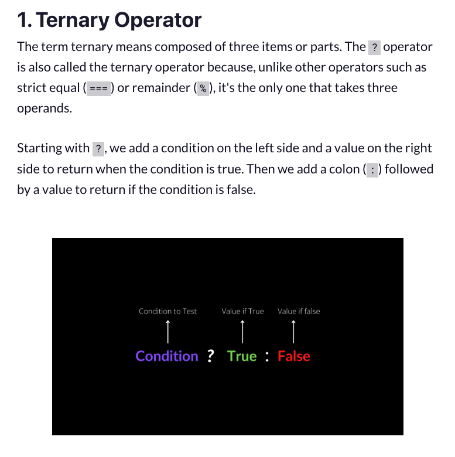
* Helpful to understand how to use ? and : in javascript

## Scope
* Definition -- Scope is the set or group of variables, functions and objects you can access at a given time.

## Hoisting
* Definition -- Hoisting is JavaScript’s default behavior for moving all of our declarations to the top of our code. (script or function)

## ES6 Modules
* 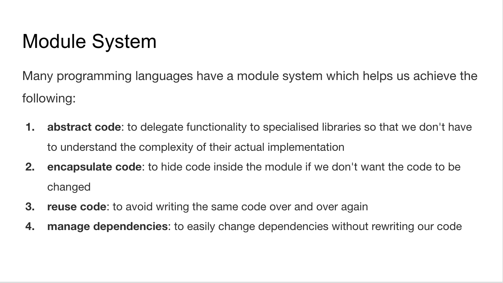
* ES6 introduced a modular system that is hoped to become a standard way of using modules in javascript

## Local Storage
* Cookies were once used for general client-side storage. While this was legitimate when they were the only way to store data on the client, __it is recommended nowadays to prefer modern storage APIs.__ Cookies are sent with every request, so they can worsen performance (especially for mobile data connections). Modern APIs for client storage are the Web storage API (localStorage and sessionStorage) and IndexedDB.
* `document.cookie = "username=John Doe; expires=Thu, 18 Dec 2013 12:00:00 UTC";`
* Web Storage APU
    * window.localStorage // stores data with no expiration date 
    * window.sessionStorage // stores data for one session (data is lost when the browser tab is closed)
* 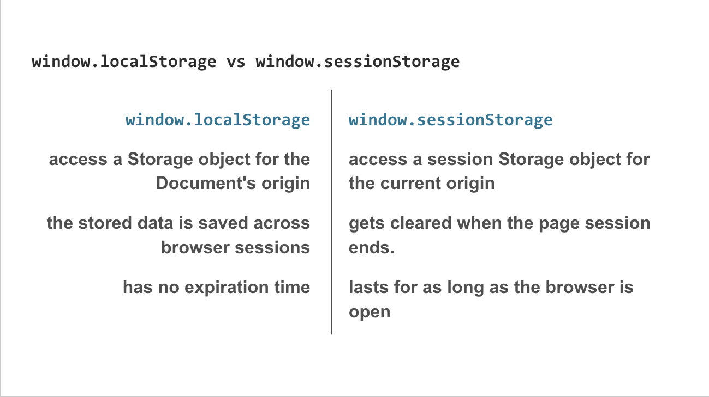

* Session Storage
```
// Save data to sessionStorage
sessionStorage.setItem('key', 'value');

// Get saved data from sessionStorage
let data = sessionStorage.getItem('key');

// Remove saved data from sessionStorage
sessionStorage.removeItem('key');

// Remove all saved data from sessionStorage
sessionStorage.clear();
```

* Local Storage
```
// Save data to localStorage
localStorage.setItem('key', 'value');

// Get saved data from localStorage
let data = localStorage.getItem('key');

// Remove saved data from localStorage
localStorage.removeItem('key');

// Remove all saved data from localStorage
localStorage.clear();
```

## AJAX
* 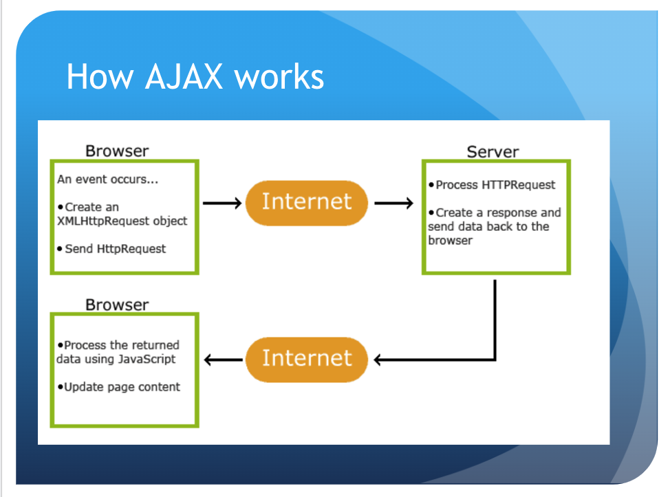

## JSON
* XMLHttpRequests must be called before any other method calls
* this.status values -- https://developer.mozilla.org/en-US/docs/Web/HTTP/Status
* this.readyState values -- https://developer.mozilla.org/en-US/docs/Web/API/XMLHttpRequest/readyState
* XMLHttpRequests.open() -- https://developer.mozilla.org/en-US/docs/Web/API/XMLHttpRequest/open
* XMLHttpRequests.send() -- https://developer.mozilla.org/en-US/docs/Web/API/XMLHttpRequest/send
* readystatechange event -- https://developer.mozilla.org/en-US/docs/Web/API/XMLHttpRequest/readystatechange_event

## _Regex_
* https://regex101.com/ -- good place to practice regular expressions
* 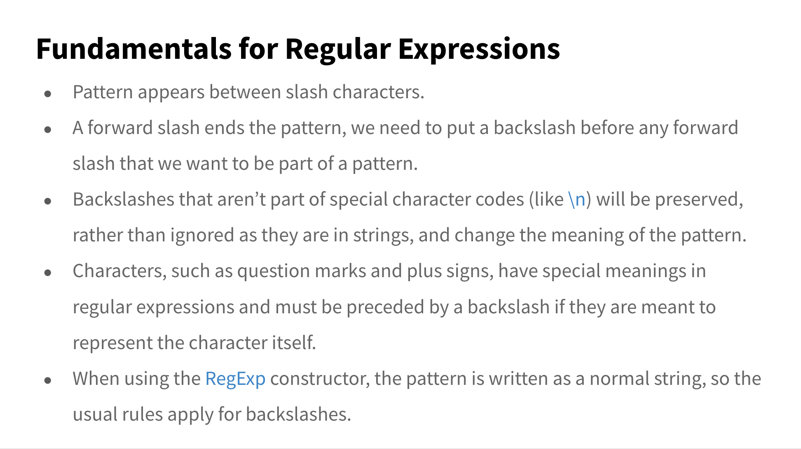
* ![Match characters or digits in a range [x-y]](./assets/Match-characters-or-digits-in-a-range-%5Bx-y%5D.png)
* 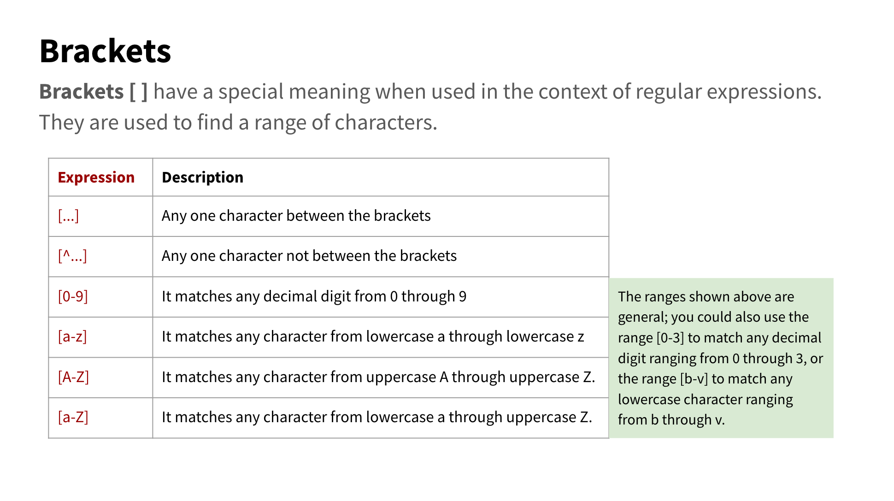
* 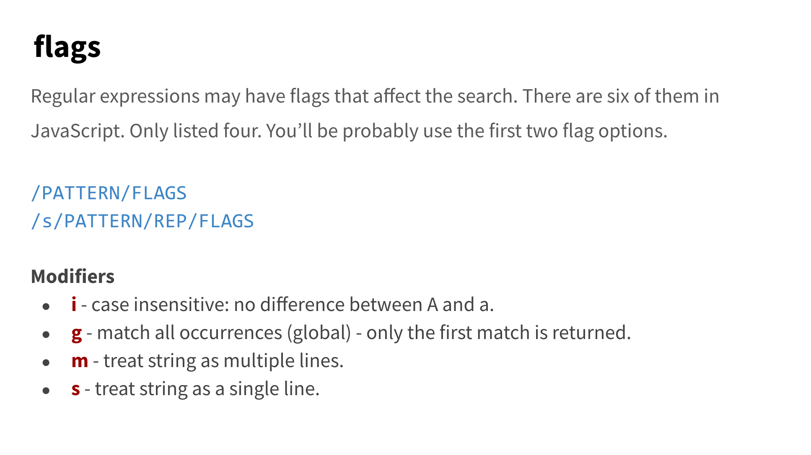
* 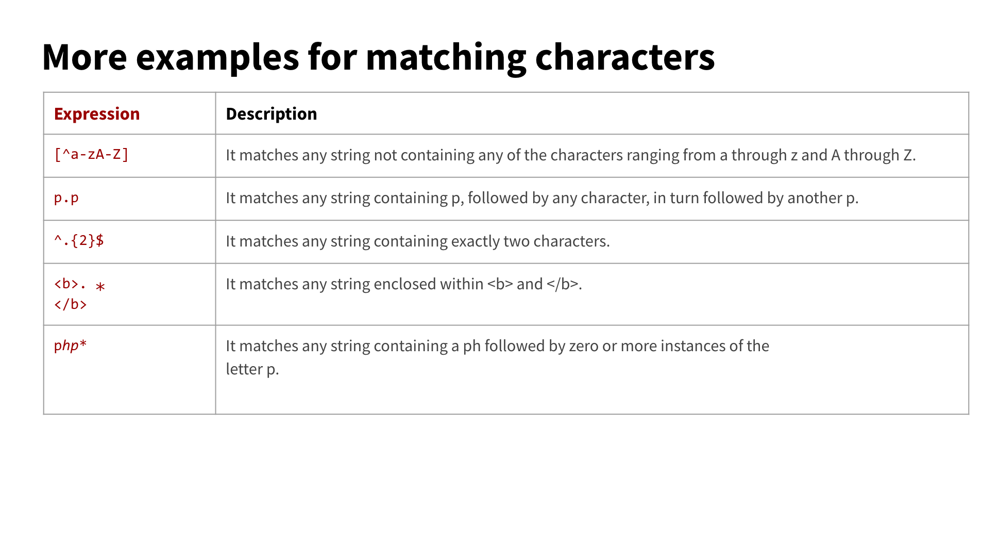
* 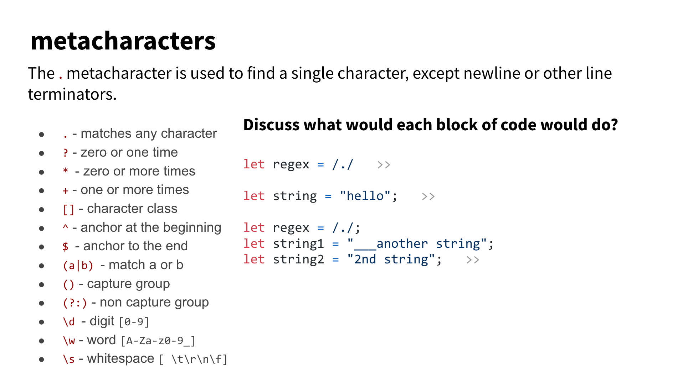
* 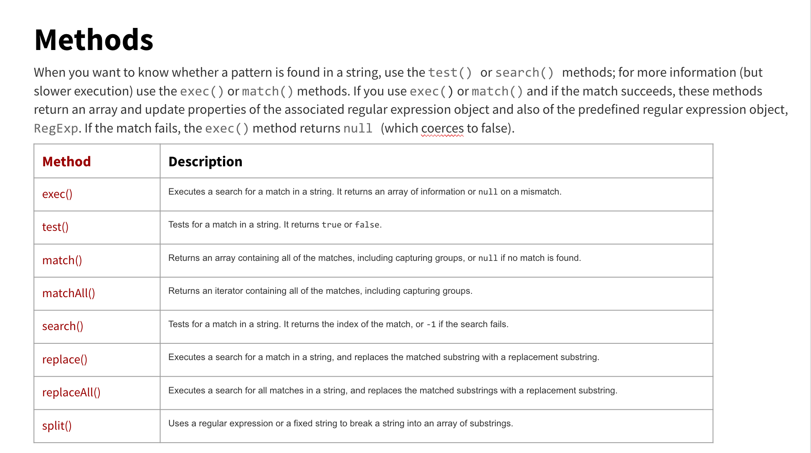
* 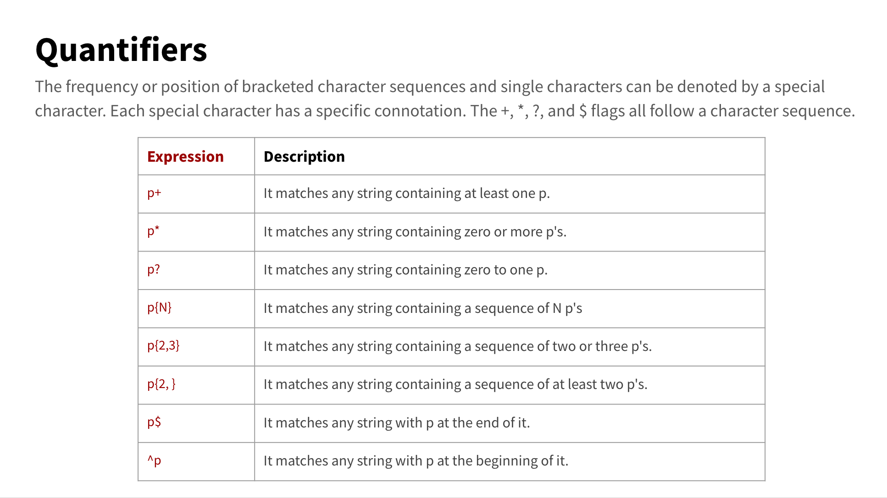
* 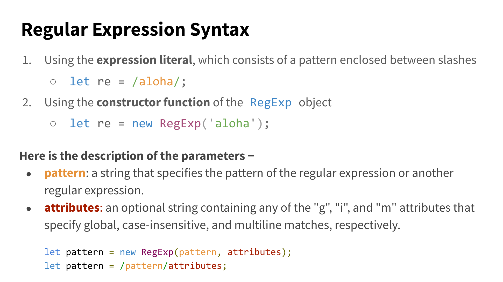

## SET Built-In Object
* A value in the set __may only occur once__ 
    * it unique to that set's collection
* set.add() inserts the element into the set succesfully
* set.has() checks if the value is already in the set object

## Data Structures
* important to learn about understand how data is stored and sorted
* 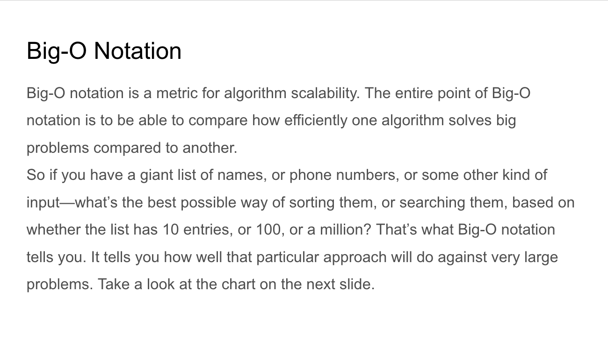
    * 

### Stack and Queue
* Stack -- Last In First Out
    * Push
    * Pop
* Queue -- First In First Out

### Linked Lists
* Linked list is a linear collection of data elements
* Advantages of Linked Lists
    * Add or Remove elements without re-alllcating the rest of the elements
    * Add or Remove elements from any place in the list
* 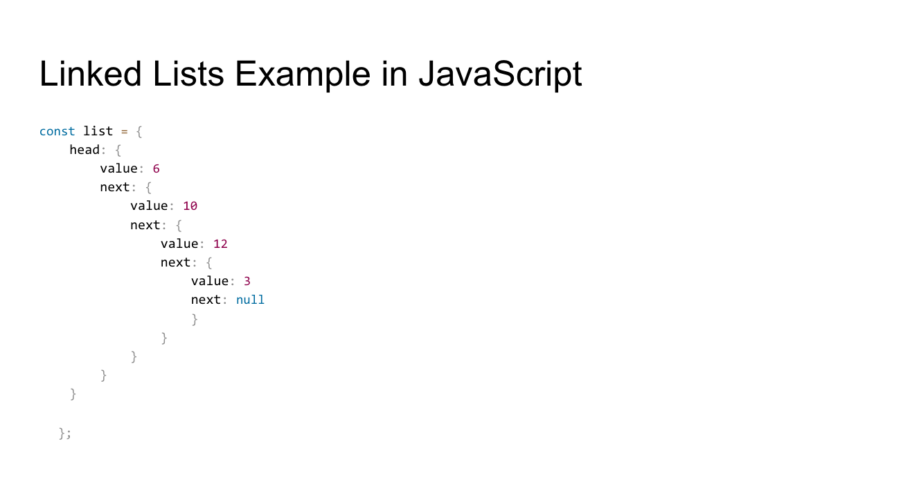;
* Linked List Methods
    * insert - inserts a new node with the given value in the list
    * remove - removes the first node that contains the given value
    * contains - determines if a node with the given value is present ex: array.includes()
    * size - returns the number of nodes in the list
    * toString - returns the data elements in the list as a string

## Binary Search
* 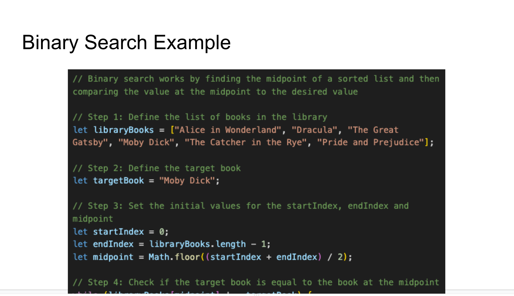
* 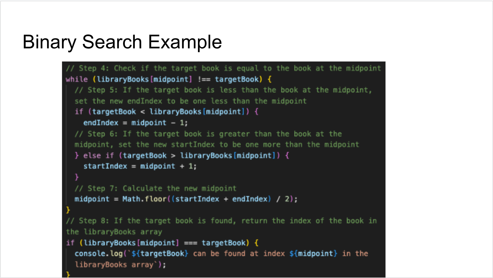
    * This example the array is not sorted first you must sort the array first

## Sorting Algorithm
* 

## Searching Algorithm
* 

# React, Node and NEXT
* JSX - Javasript XHTML
* React has both html and javascript code

```
array.map(element => {

});
```
* map is immutable -- mutable => changable
* React Components need to be captilized -- MyButton
* Parentheses are HTML
* Brackets are javascript

* Re-Render
    1. It’s the component’s initial render.
    2. The component’s state has been updated.


# Node.js
## What is Node
* A platform to write javascript programs
* https://nodejs.org/api/globals.html -- just like mdn // Does not have a search bar

# Backend Security and Development
## SSL/TLS Cerificates
* SSl --> Secure Sockets Layer (SSL) is a standard security technology for establishing an encrypted link between a server and a client
    * SSL certificates will renew when expired, need to get it manually
        * Will cause a lot of problems for the website owner and website usersban
* TLS --> Transport Layer Security (TLS) 
## Docker
* Ephemeral --> the volatile temporary storage attached to your container/images which is only present during the running lifetime of the container/images
* Continuous Integration, Continuous Deployment(CICD) --> is a method to frequently deliver apps to customers by introducing automation into the stages of app development.
### Docker Command Line Commands
* docker run --> create and start up a docker container for the first time
* docker start --> start a stopped container
* docker ps -a --> lists all docker containers
* docker stop [containerID] --> stops the docker container
* docker images --> list all images
* docker rm [containerID] --> removes the container
* docker rmi [name] --> removes the image
* docker help --> list all commands for docker
* docker pull [imageName]


### Docker File Commands
* FROM image:tag
    * From command must be the first command in the file
* LABEL `<name>='<value>'`
    * OPTIONAL --> set metadata information that appears in the image
* WORKDIR /path/in/container
    * Set the current working directory inside the container
        * Uses as the relative destination for COPY or ADD commands
* COPY <src> <dest>
    * Copy files from the LOCAL system into the container
* ADD <src> <dest>
    * Similar to the COPY command but can be used on archives and internet URLs
    * ADD can unzip files while COPY cannont
* RUN <shell commands>
    * Run shell commands inside the container during the Build process
* EXPOSE <port>[/<protocol>]
    * 
* CMD ["<exec_cmd>", "<option>", ...]
    * CMD ["npm", "start"]
    * Provide the command to execute when the container starts

### Docker Build Context
* docker build -t <image>:<tag>.
    * build --> Command
    * -t --> Options
    * <image> --> Image Name
    * <tag> --> Tag
    * . --> Path

# AWS Hosting
## Cloud Concepts
* Cloud Computing is the on-demand delivery of compute power. database, storage, applications, and other IT resources via the internet with pay-as-you-go pricing
* IaaS (infrastructure as a service) --> more control over IT resources
* Paas (platform as a service) --> middle between both Iaas and SaaS
* SaaS (software as a service) --> less control over IT resources

* AWS Perspectives
    -   Business
    -   People
    -   Governace
    -   Security
    -   Operations
    -   

## Cloud Economics and Billing
* Three fundamental frivers of cost with AWS
    -   Compute
    -   Storage
    -   Data Transfer
* Pay for what we need
* Total Cost of Ownership(TCO) --> is the financial estimate to help identify direct and indirect costs of a system
    -   Server Costs
    -   Storage Costs
    -   Network Costs
    -   IT Labor Costs


## AWS Global Infrastructure
* AWS Region is a geographical area
    -   Data replication across Regions is controlled by us
    -   Communication between Regions uses AWS backbone network infrastructure
* A Region typically consists of two or more Availability Zones
* Selecting a Region
    -   Data goverance legal requirements
    -   Proximity to Consumers
    -   Services available within the Region
    -   Costs (vary by Region)
* Availability Zone is a fully isolated partition of the AWS infrastructure
    -   Avaiblability Zones consist of discrete data centers
    -   They are designed for fault isolation
* Points of Presence
    -   A global Content Delivery Network (CDN), that delivers content to end users with reduced latency
* AWS infrasture features
    * Elasticity and scalability
        -   Elastic infrastructure; dynamic adaption of capacity
        -   Scalable infrastructure; adapts to accommodate growth
    * Fault-tolerance
        -   Continues operating properly in the presence of a failure
        -   Built-in redundancy of components
    * High availability
        -   High level of operational performace
        -   Minimized downtime
        -   No human intervention

## AWS Cloud Security
* Customer --> Responsibilty for security 'in' the cloud
* AWS --> Responsibilty for security 'of' the cloud
* Infrustructure as a service is customer mangaged (IaaS)
* Platform as a service is AWS managed (PaaS)
* Software as a service is AWS managed(SaaS)
* IAM 
    -   IAM User
    -   IAM Group
    -   IAM Role
    * IAM User
        * Programmatic Access
            -   Access Key ID
            -   Secret Access Key
        * AWS Management Console Access
            -   IAM username
            -   IAM password
            -   12-digit Account ID or alias
            -   multi-factor authentication (MFA)
    * IAM policy is a document that defines permissions
    * Resource-based policies are attached to a resource (not to a user, group or role)
    * IAM Group
        * A collection of IAM Users
    * IAM Roles
        * An IAM identity with specific permissions
        * Not uniquely associated with one person
        * Temporaryy security credentials
        * Examples of IAM roles delegating access
            -   Used by an IAM user in the same AWS account as the role
            -   Used by an AWS service -- such as EC2 -- in the same account as the role
            -   Use by an IAM user in a different AWS account than the role
* Securing a New AWS Account
    -   Create Root user with email and password
    * Step 1 -- Stop using the account root user
    * Step 2 -- Enable multi-factor authentication
    * Step 3 -- Use AWS CloudTrail
    * Step 4 -- Enable a billing report, such as the AWS Cost and Usage Report
* Securing Accounts
    * Service Control Policies (SCPs) offer centralized control over accounts
        * SCPs are similar to IAM permissions policies
            -   They use similar syntax
            -   Instead, SCPs specify the maximum permission for an organization
    * AWS Key Management Service (AWS KMS)
        -   Enables you to create and manage encryption keys (private keys)
    * Amazon Cognito
        -   Adds user sign-up, sign-in, and access control to your web and mobile applications
    * AWS Shield
        -   DDoS protection service
        -   Use it to minimize application downtime and latency
* Securing Data
    * Encryption encodes data with a secret key, which makes it unreadable
    * AWS supports encryption of data at rest
        -   Data at rest = Data stored physically
    * Encrytion of data in transit (data moving across a network)
    * AWS services support data in transit encrytion
* Working to Ensure Compliance
    * AWS Config
        -   Assess, audit, and evaluate the configuratinos of AWS resources
        -   Automatically evaluate recorded configurations versus desired configurations
        -   Simplify compliance auditing and security analysis
    * AWS Artifact
        -   Is a resource for compliance-related information
    
## Networking and Content Delivery
* Networking Basics
    * IP Addresses
* Amazon VPC
    -   Enables you to provision a logically isolated section of the AWS Cloud where you can launch AWS resources in a virtual network that you define
    -   Logically isolated from other VPCs
    -   Dedicated to your AWS account
    -   Belong to a single AWS Regionand can span multiple Availability Zones
    -   You cannot change the address range after you create the VPC
    -   When you create a VPC, you assign it to an IPv4 CIDR block (range of private IPv4 addresses)
    -   CIDR blocks of subnets cannot overlap
    -   Every instance has a default network interface
    * Route Table
        -   A route table contains a set of rules that you can configure to direct network traffic from your __subnet__
        -   Each route specifies a destination and a target
        -   Each subnet must be associated with a route table (at most one)
    * VPC Endpoints
        -   Interface endpoints (powered by AWS PrivateLink)
        -   Gateway endpoints (Amazon S3 and Amazon DynamoDB)
    


# Automated QA

## Unit Testing
* Unit Test --> Tests one small part of your code
* Integration Test --> Test how the whole application works
* Automated Test --> Test the users experience in the browser
* Test Driven Development (TDD) --> We use unit tests to drive the development of our software. We define tests first, and then write the code that makes the tests pass.
* Behavior Driven Development(BDD) --> we define behaviors first, then define thetests that implement those behaviors, then write the code that implements the test. By defining behaviors first, we are able to make the tests useful as verification that we are building the right feature, and asking the correct questions, not just that our code is correct. We use phrasing in business language, thus making it useful to every member of a cross-functional product team.
* Jasmine BDD testing browser
    * https://jasmine.github.io/tutorials/your_first_suite


# Database

## MongoDB 
* SQL --> 
* Non-SQL --> 
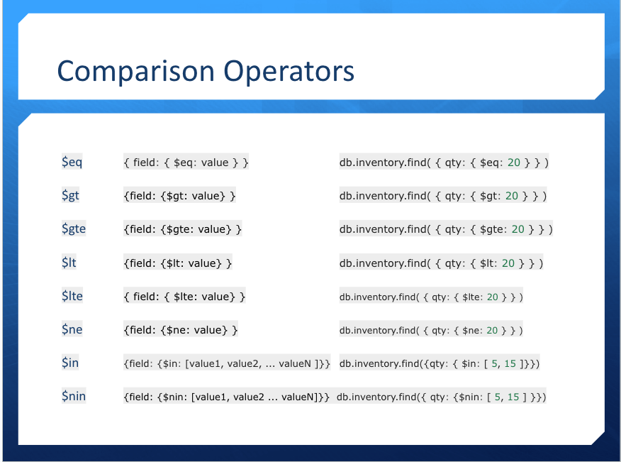
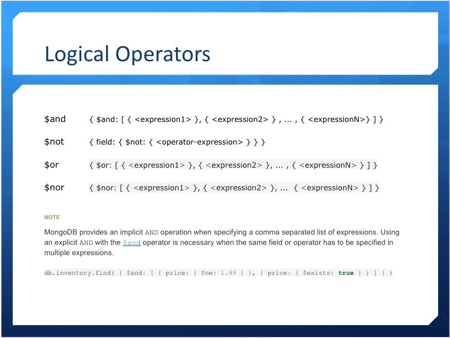
# Soft Skills

## Working in a Software Company

* Industry
* Type of Dev Company
* Company Size
* Market (Who are the competitors)
* Users/Customers
* Products/Service

### Questions to ask Myself

* How do software companies get work done?
* What are the different typpes of web developer jobs?
* What Knowledge, Skills & Abilities do you need

### What are THEY Looking for?

* Resume - updating resume to fit the goals or the PLAN of the company

### Searching for Jobs

* Networking
    1. Have neighbors or colleagues to help find jobs that are hiring
    2. Use linkedIn or indeed to network online to show skills that I have
